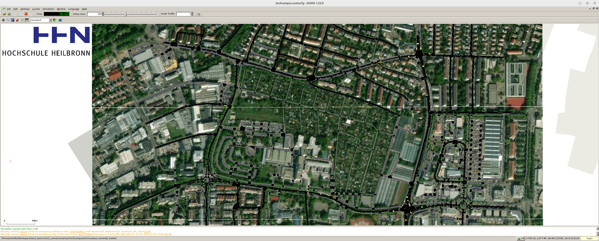

# README

This tutorial handles configuration of the TechCampus Scenario. It is built with SUMO v1.26.0.



## Design and definition of the scenario

1. Download map via OpenStreetMap directly from browser [^1].

2. Create `techcampus.netcfg` file, storing the netconvert configuration.
This enables rebuilding the network.

```shell
netconvert --save-configuration techcampus.netcfg --save-commented TRUE --osm-files map.osm -o techcampus.net.xml --geometry.remove TRUE --tls.discard-simple TRUE --tls.join TRUE --tls.guess-signals TRUE --tls.default-type actuated --ramps.guess TRUE --junctions.join TRUE --verbose TRUE --log log/netconvert.log
```

```shell
netconvert -c techcampus.netcfg
```

3. Create `techcampus.polycfg` for the parameters how to derive shapes.

```shell
polyconvert --save-configuration techcampus.polycfg --save-commented TRUE --net-file techcampus.net.xml --osm-files map.osm --type-file /usr/share/sumo/data/typemap/osmPolyconvert.typ.xml --output-file techcampus.poly.xml --verbose TRUE --xml-validation auto --log log/polyconvert.log
```

```shell
polyconvert -c techcampus.polycfg
```

4. Apply tileget in order to download satellite data:

```shell
python3 /usr/share/sumo/tools/tileGet.py -n techcampus.net.xml -t 20 -d tiles/ -m satellite
```

5. Model vehicle-type specific traffic for passenger cars, busses, trucks and trailers via randomTrips.py, e.g.

```shell
# The value after -p is the period at which vehicles are generated in seconds.
python3 /usr/share/sumo/tools/randomTrips.py -n techcampus.net.xml -e 3600 --prefix="pass" -p 1   --min-distance 1000 -r pass_routes.rou.xml -o pass_trips.xml --vehicle-class passenger --trip-attributes="color=\"255,255,255\"" --verbose

python3 /usr/share/sumo/tools/randomTrips.py -n techcampus.net.xml -e 3600 --prefix="bus" -p 30  --min-distance 1000 -r bus_routes.rou.xml -o bus_trips.xml --vehicle-class bus --trip-attributes="accel=\"0.8\"" --verbose

python3 /usr/share/sumo/tools/randomTrips.py -n techcampus.net.xml -e 3600 --prefix="truck" -p 15  --min-distance 1000 -r truck_routes.rou.xml -o truck_trips.xml --vehicle-class truck --trip-attributes="color=\"179,223,183\"" --verbose

python3 /usr/share/sumo/tools/randomTrips.py -n techcampus.net.xml -e 3600 --prefix="trailer" -p 150  --min-distance 1000 -r trailer_routes.rou.xml -o trailer_trips.xml --vehicle-class delivery --trip-attributes="color=\"115,211,230\"" --verbose
```

6. Finally, stitch everything together by designing an appropriate configuration file `techcampus.sumocfg` file:

```xml
<?xml version="1.0" encoding="UTF-8"?>

<configuration xmlns:xsi="http://www.w3.org/2001/XMLSchema-instance" xsi:noNamespaceSchemaLocation="http://sumo.dlr.de/xsd/sumoConfiguration.xsd">

    <input>
        <net-file value="techcampus.net.xml"/>
        <route-files value="pass_routes.rou.xml,bus_routes.rou.xml,truck_routes.rou.xml,trailer_routes.rou.xml"/>
        <additional-files value="techcampus.poly.xml,techcampus.poi.xml,techcampus.tllogic.xml"/>
    </input>

    <time>
        <begin value="0"/>
        <end value="10000"/>
        <step-length value="0.1"/>
    </time>

    <gui_only>
        <gui-settings-file value="tiles/settings.xml"/>
        <delay value="1000.0"/>
        <start value="false"/>
        <tls.actuated.show-detectors value="true"/>
    </gui_only>

    <report>
        <verbose value="true"/>
    </report>

</configuration>
```

7. Defining TLS programs.

Traffic Light Signal programs can be integrated as definitions as part of an additional file.
One can switch those TLS programs using GUI context menu or TraCI.
A definition of a traffic light program within an additional-file looks like this:

```xml
<?xml version="1.0" encoding="UTF-8"?>

<additional xmlns:xsi="http://www.w3.org/2001/XMLSchema-instance" xsi:noNamespaceSchemaLocation="http://sumo.dlr.de/xsd/additional_file.xsd">

  <tlLogic id="24950122" programID="my_techcampus_program_0" offset="0" type="static">
    <phase duration="31" state="GGggrrrrGGggrrrr"/>
    <phase duration="5"  state="yyggrrrryyggrrrr"/>
    <phase duration="6"  state="rrGGrrrrrrGGrrrr"/>
    <phase duration="5"  state="rryyrrrrrryyrrrr"/>
    <phase duration="31" state="rrrrGGggrrrrGGgg"/>
    <phase duration="5"  state="rrrryyggrrrryygg"/>
    <phase duration="6"  state="rrrrrrGGrrrrrrGG"/>
    <phase duration="5"  state="rrrrrryyrrrrrryy"/>
  </tlLogic>

  <tlLogic id="24950122" programID="my_techcampus_program_1" offset="0" type="static">
    <phase duration="31" state="GG"/>
    <phase duration="5"  state="rr"/>
    <phase duration="6"  state="yy"/>
    <phase duration="5"  state="gr"/>
  </tlLogic>
</additional>
```

### References

[^1] https://www.openstreetmap.org/export#map=17/49.122987/9.214203

## License

This repository is only to be used for academic research and education within the
University of Applied Sciences Heilbronn.

