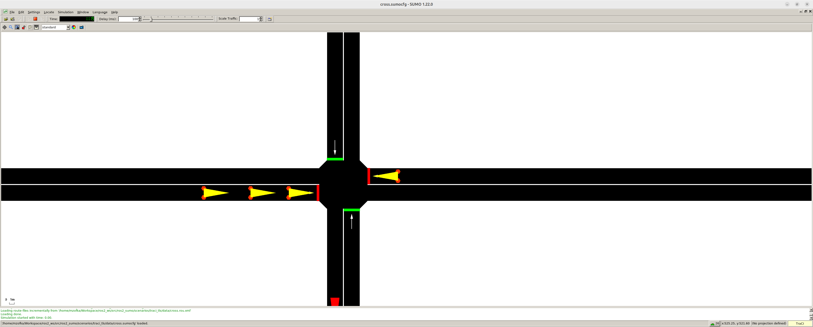

# README

This tutorial handles the usage of the traci_tls example. It demonstrates a 
very simple intersection layout to demonstrate the usage of traffic lights 
and interaction with induction loop. 

The original example is copied from the web resource 
[TLS Example](https://sumo.dlr.de/docs/Tutorials/TraCI4Traffic_Lights.html).

